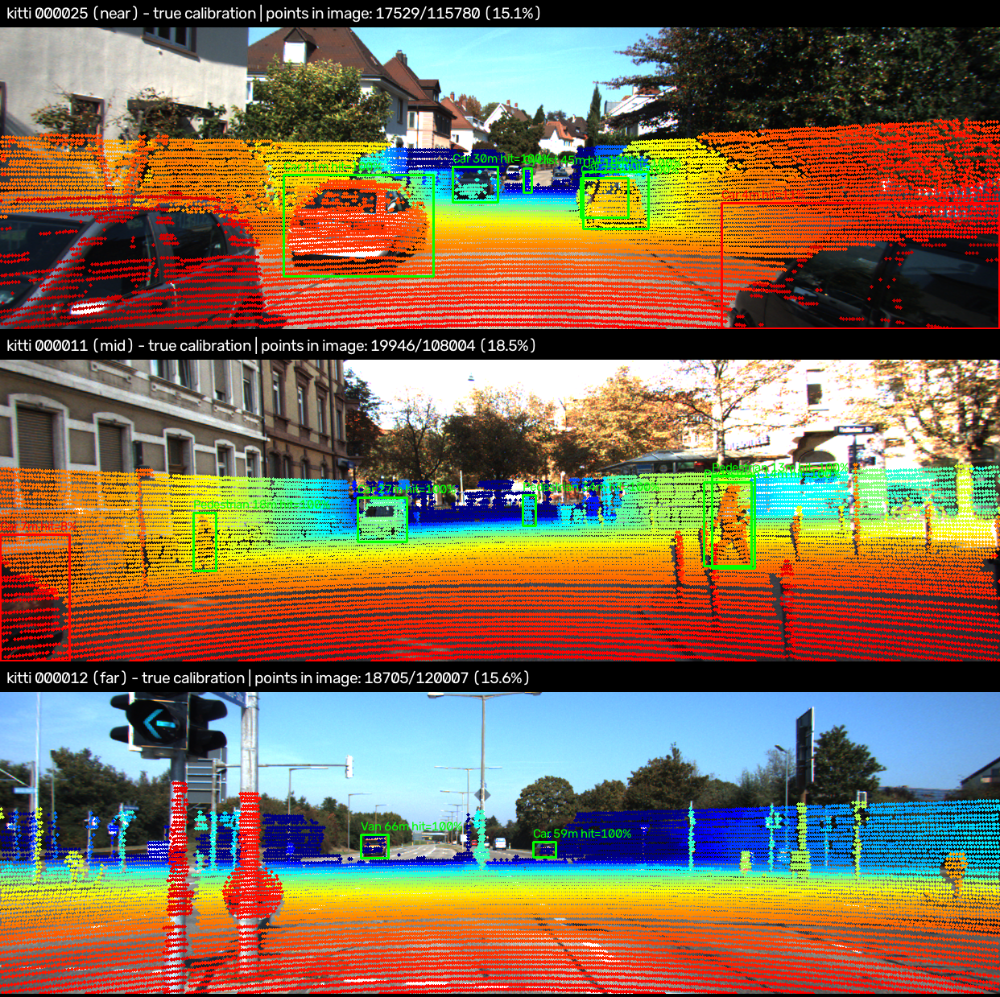
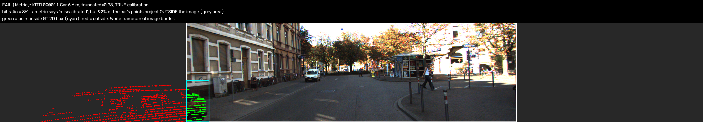
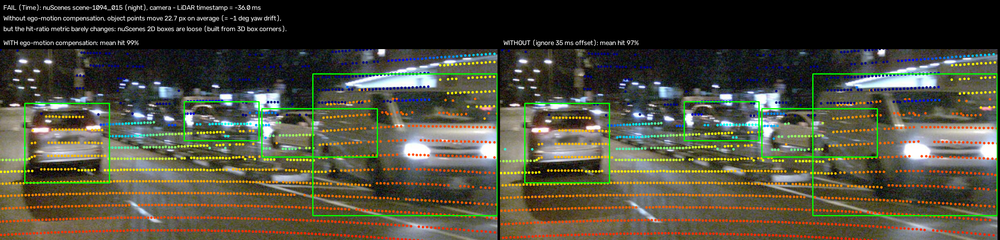
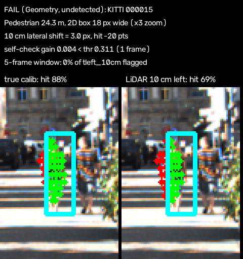

# Báo cáo Day 6: Calibration drift LiDAR–camera — đo thiệt hại và tự phát hiện không cần label

- **Họ tên:** Nguyen Cong Thinh
- **MSSV:** 2A202602781 (phải trùng với MSSV trong tên repo `<HoVaTen>-<MSSV>-Track4-Day21`)
- **Lớp:** VinUni AI20K — Track 4: Computer Vision and Robotics
- **Link repo:** https://github.com/2003congthinh/NguyenCongThinh-2A202602781-Track4-Day21
- **Topic:** A — LiDAR-camera projection QA (mức Basic + Good + Advanced)
- **Dataset:** data/kitti_mini (chính), data/nuscenes_mini_subset (so sánh, bonus B5), data/synthetic (debug CP2 + bonus B6)
- **Các frame đã dùng:** toàn bộ 20 frame KITTI (000001 … 000061) và toàn bộ 80 keyframe nuScenes (scene-0103_000 … 039, scene-1094_000 … 039). Ảnh demo: KITTI 000025 (gần), 000011 (trung bình), 000012 (xa); failure: 000011, 000015, scene-1094_015

## 1. Claim

**Trên KITTI, lệch yaw 1° làm tỉ lệ điểm LiDAR của vật rơi đúng vào 2D box giảm từ 98.9% xuống 70.6% (vật > 30 m chỉ còn 59.2%), trong khi % điểm nằm trong FOV gần như không đổi (15.75% → 15.76%). Một edge-alignment self-check không cần label, gộp 5 frame, phát hiện 100% drift yaw/pitch ≥ 1° với 0 báo động giả. Nhưng nó không phát hiện được lệch tịnh tiến 10 cm, và không dùng được trên LiDAR 32 beam của nuScenes.**

- Đại lượng: `hit %` = % điểm LiDAR nằm trong 3D box GT (tìm bằng calib đúng) mà khi chiếu bằng calib lệch vẫn rơi vào 2D box GT. Tính trung bình trên các object mức "moderate" (truncation ≤ 0.3, occlusion ≤ 1, ≥ 10 điểm): 68 object KITTI, 195 object nuScenes.
- Mỗi lần chỉ thay đổi **một** trục, theo hệ toạ độ vật lý của xe (yaw/pitch/roll 0.5/1/2/3°, dịch trước/trái/lên 2/5/10 cm). Code không có phép ngẫu nhiên nào: chạy lại `src.perturb_sweep` cho ra file CSV giống hệt (cùng md5).

## 2. Evidence

**(a) Demo — overlay ở 3 khoảng cách** (`python -m src.demo_overlays`). Box xanh lá: hit ≥ 80%. Box đỏ: hit < 80%.



**(b) Cùng frame 000011 ở yaw 0/1/2/3°.** Pedestrian 34 m chuyển sang đỏ (hit 8%) ngay từ 1°, pedestrian 13 m vẫn xanh. Ảnh: `results/figures/demo_kitti_yaw_drift_000011.png`. Bản nuScenes: `results/figures/demo_nusc_*.png`.

**(c) Thí nghiệm chính** (`results/perturb_sweep.csv`; biểu đồ `results/figures/sweep_hit_vs_drift.png` và `sweep_hit_by_distance.png`):

| Drift (KITTI, 68 object) | FOV % | hit % | hit < 15 m | hit 15–30 m | hit > 30 m | dịch TB (px) | nuScenes hit % (195 obj) | nuScenes dịch (px) |
|---|---|---|---|---|---|---|---|---|
| baseline | 15.75 | **98.9** | 99.6 | 97.9 | 99.5 | 0 | 99.4 | 0 |
| yaw 0.5° | 15.76 | 88.3 | 97.2 | 84.9 | 84.8 | 6.8 | 98.3 | 12.6 |
| yaw 1° | 15.76 | **70.6** | 91.5 | 65.2 | **59.2** | 13.7 | 94.0 | 25.2 |
| yaw 2° | 15.77 | 44.8 | 76.5 | 44.3 | 18.1 | 27.4 | 79.6 | 50.5 |
| yaw 3° | 15.77 | 32.3 | 67.9 | 30.9 | 3.4 | 41.1 | 61.9 | 75.9 |
| pitch 1° | 15.02 | 75.0 | 98.8 | 84.7 | 42.5 | 12.8 | 88.5 | 22.9 |
| roll 1° | 15.76 | 98.2 | 99.3 | 96.9 | 98.9 | 2.8 | 99.3 | 6.5 |
| roll 3° | 15.79 | 92.4 | 96.4 | 90.7 | 90.9 | 8.2 | 93.6 | 19.6 |
| dịch trái 10 cm | 15.76 | 96.4 | 97.8 | 93.9 | 98.2 | 4.0 | 99.1 | 7.9 |
| dịch lên 10 cm | 16.48 | 97.0 | 96.5 | 95.6 | 99.1 | 4.0 | 99.2 | 7.9 |
| dịch trước 10 cm | 16.08 | 98.8 | 99.3 | 97.9 | 99.4 | 1.1 | 99.5 | 2.4 |

Nhận xét:
- **Yaw và pitch là nguy hiểm, roll và tịnh tiến thì nhẹ.** Phép xoay làm điểm lệch một góc cố định, khoảng f·θ ≈ 12.6 px mỗi 1° với f = 721 px. Box của vật xa thì nhỏ, nên vật xa mất nhiều điểm nhất. Ngược lại, tịnh tiến làm điểm lệch f·t/z px, nên ảnh hưởng nhỏ dần theo khoảng cách.
- **% điểm trong FOV vô dụng để phát hiện drift.** Nó gần như không đổi khi yaw thay đổi.
- **KITTI và nuScenes khác nhau (B5).** Pixel bị dịch trên nuScenes lớn gấp khoảng 1.8 lần (f ≈ 1266 px so với 721 px), nhưng hit % lại giảm ít hơn nhiều (−5.4 so với −28.3 điểm ở yaw 1°). Lý do: 2D box của nuScenes được dựng từ 8 góc của 3D box đã chiếu lên ảnh, nên rộng hơn hẳn box KITTI do người vẽ sát vật. Vì vậy cùng một metric nhưng **không so được trực tiếp** giữa hai dataset.

**(d) Advanced — tự phát hiện drift không cần label** (`python -m src.drift_detection`; `results/drift_detection.csv`; biểu đồ `results/figures/drift_score_and_detection.png`).
- Score = trung bình `exp(−d/3px)` trên các điểm "depth edge", tức điểm nằm ở mép vật mà ngay cạnh có điểm xa hơn hẳn. `d` là khoảng cách tới cạnh Canny gần nhất trên ảnh.
- Self-check: thử thêm 24 phép xoay nhỏ (±0.5/1/2/3° quanh mỗi trục) quanh calib hiện tại, rồi tính `gain = score tốt nhất / score hiện tại − 1`.
- Ngưỡng = gain lớn nhất trên mẫu baseline + 0.02.
- So sánh 2 cấu hình detector (B1): dùng 1 frame và gộp cửa sổ trượt 5 frame.

| Detector | Ngưỡng | yaw 0.5° | yaw 1° | yaw ≥ 2° | pitch ≥ 0.5° | roll 1° | roll ≥ 2° | dịch trái / trước 10 cm | dịch lên 10 cm |
|---|---|---|---|---|---|---|---|---|---|
| KITTI 1 frame (n = 20) | 0.311 | 10% | 10% | 20–35% | 5–75% | 0% | 15–30% | 0% | 10% |
| **KITTI cửa sổ 5 frame (n = 16)** | 0.043 | 69% | **100%** | **100%** | **100%** | 81% | 100% | **0%** | 38% |
| nuScenes 1 frame (n = 80) | 6.81 | 0% | 0% | 0% | 0% | 0% | 0–1% | 0–1% | 1% |
| nuScenes cửa sổ 5 frame (n = 72) | 1.74 | 3% | 3% | 0–1% | 0–6% | 0% | 0–1% | 0–3% | 0% |

- Mọi cấu hình đều có 0 báo động giả trên baseline. Lưu ý: ngưỡng được chọn và đánh giá trên cùng một tập frame, chưa có tập kiểm tra riêng.
- Ở KITTI cửa sổ 5 frame, phép xoay tốt nhất mà self-check tìm ra **chính là phép sửa đúng drift**: `yaw-1.0` trong 16/16 cửa sổ bị lệch yaw 1°, và `pitch-1.0` trong 16/16 cửa sổ bị lệch pitch 1°.

**(e) Latency (B3)** (`results/latency.csv`; CPU AMD64 Family 23 Model 96, 6 luồng, Windows; bỏ lần chạy đầu, đo 30 lần). Trên KITTI 108k điểm:

| Bước | p50 | p95 |
|---|---|---|
| chiếu điểm lên ảnh | 14.3 ms | 15.6 ms |
| 1 lần tính edge score | 18.5 ms | 19.5 ms |
| self-check đủ 25 lần tính | 455 ms | 516 ms |

Trên nuScenes, self-check mất 313 / 368 ms (p50 / p95).

**(f) Lỗi cài sẵn trong data/synthetic (B6)** (`python -m src.synthetic_audit` → `results/synthetic_anomalies.csv`):

| Lỗi | Frame | Cách phát hiện |
|---|---|---|
| Khoảng 23 điểm NaN mỗi frame (0.10%) | 000000–000004 | `np.isfinite` |
| Mất điểm ở sector azimuth −40° → 0° (bên phải xe): 191–462 điểm mỗi bin so với trung vị 645–708 | 000003 | histogram azimuth 10° so với trung vị các frame |
| Tổng số điểm thấp: 22 063 so với trung vị 23 781 | 000003 | n_points < 95% trung vị |
| Timestamp nhảy 0.2 s, các khoảng khác đều 0.1 s | 000002 → 000003 | `diff(timestamps.txt)` so với trung vị |

## 3. Failure case



**F1 — Lớp Metric: calib đúng nhưng metric báo "lệch".** Xe ở 6.6 m trong frame 000011 bị truncation 0.98. Với calib **đúng** mà hit chỉ đạt 7.5%, vì 92.4% điểm của xe rơi **ra ngoài ảnh**, trong khi 2D box bị cắt ở mép ảnh. Nếu tính trung bình trên mọi object, chừng đó vật bị cắt đủ để kéo hit % xuống thấp và gây báo động giả. Cách xử lý: lọc truncation ≤ 0.3 (đúng như đã làm) hoặc chỉ đếm những điểm chiếu vào trong ảnh. Khi chạy thật, log thêm tỉ lệ vật bị cắt ở mép ảnh.



**F2 — Lớp Time: lỗi đồng bộ giống hệt calibration drift.** Trên nuScenes, LiDAR và camera chụp lệch nhau 36 ms. Nếu bỏ bù chuyển động xe (`use_ego_motion=False`), điểm lệch trung bình 22.7 px. Mức này tương đương drift yaw khoảng 1° (f·1° ≈ 22 px), vậy mà hit chỉ giảm từ 98.8% xuống 97.0%, vì box nuScenes rộng. Như vậy metric hit-in-box trên nuScenes không đủ nhạy, và một detector drift có thể đổ lỗi cho calibration trong khi lỗi thật nằm ở timestamp. Cách xử lý: luôn log `t_cam − t_lidar` và tốc độ ego. Chỉ kiểm tra calibration khi xe đứng yên hoặc khi đã bù chuyển động.



**F3 — Lớp Geometry: detector không phát hiện được.** LiDAR bị dịch 10 cm sang trái. Pedestrian ở 24.3 m trong frame 000015 chỉ lệch 3 px, nhưng vì box của người hẹp (18 px), hit giảm từ 88% xuống 69% (−20 điểm). Self-check chỉ thử các phép **xoay**: gain = 0.004, thấp hơn ngưỡng 0.311 khi dùng 1 frame, và cửa sổ 5 frame phát hiện 0% trường hợp `tleft_10cm`. Nguyên nhân: ở xa, phép tịnh tiến làm lệch rất ít pixel, ở gần thì sai số lẫn vào nhiễu, và không phép xoay nào bù được phép tịnh tiến.

**F4 — LiDAR 32 beam làm hỏng edge score** (bảng 2d). nuScenes chỉ có khoảng 58 điểm depth-edge mỗi frame, so với khoảng 375 trên KITTI. Ngay cả khi gộp 5 frame (291 điểm) vẫn ít hơn 1 frame KITTI, nên gain ở baseline đã lớn (trung vị 0.48) và cảnh đêm của scene-1094 có rất ít cạnh Canny. Lỗi này thuộc lớp Preprocess/Metric: score phụ thuộc mật độ điểm và độ tương phản ảnh, và cần cửa sổ dài hơn hoặc đặc trưng khác.

## 4. Khuyến nghị nếu triển khai thật

- **Use-case:** ADAS có camera trước và LiDAR trên nóc. Cần một monitor tự kiểm tra calibration sau va chạm nhẹ hoặc sau khi giá đỡ cảm biến bị rung.
- **Thiết kế:** chạy edge self-check ở chế độ nền, không chạy mỗi frame. Mất khoảng 0.46 s trên CPU cho mỗi frame KITTI, nên có thể lấy 1 frame mỗi 2 giây, gộp 5 frame (khoảng 10 s), và chỉ lấy frame lúc xe chạy chậm để giảm lỗi Time (F2). Báo lỗi khi gain vượt ngưỡng trong K cửa sổ liên tiếp. Phép xoay tốt nhất (`best_nudge`) cho biết luôn trục và chiều cần sửa.
- **Đánh đổi:** cửa sổ dài thì ổn định hơn và giảm báo động giả, nhưng chậm phát hiện hơn. Lưới thử ±0.5–3° thì nhạy hơn, nhưng chi phí tăng tuyến tính (25 lần tính mỗi frame). Với LiDAR 32 beam cần cửa sổ dài hơn hẳn (F4). Phép tịnh tiến 10 cm không phát hiện được (F3), nhưng nó chỉ làm hit giảm ≤ 4 điểm trung bình. Pedestrian xa là đối tượng nhạy nhất, nên cần kiểm tra lại bằng target khi bảo dưỡng định kỳ.
- **Cần log khi chạy thật:** `gain`, `best_nudge` và số điểm depth-edge của mỗi cửa sổ; `t_cam − t_lidar`; tốc độ ego; số cạnh Canny (ánh sáng ngày/đêm); % điểm NaN; histogram azimuth (che khuất, như frame synthetic 000003).
- **Bước tiếp theo:** thêm tìm kiếm cho phép tịnh tiến; đánh giá ngưỡng trên tập frame riêng; thử thêm đặc trưng intensity edge cho LiDAR thưa.

## 5. Cách chạy lại

Toàn bộ code chạy trên CPU, không có phép ngẫu nhiên. Tất cả lệnh chạy từ thư mục gốc của repo, và script nào cũng có `--help` (B4).

```bash
pip install -r requirements.txt            # Windows: nếu lỗi UnicodeDecodeError, chạy  $env:PYTHONUTF8=1  trước
python -m starter.projection --data-root data/synthetic --frame 000000      # CP2: (10,0,0) -> z_cam 9.73, (u,v) ~ (614,175)
python -m starter.projection --data-root data/kitti_mini --frame 000011
python -m starter.projection --data-root data/nuscenes_mini_subset --frame scene-0103_010
python -m src.demo_overlays                                                 # demo_kitti_*.png
python -m src.demo_overlays --data-root data/nuscenes_mini_subset --near scene-1094_010 --mid scene-0103_030 --far scene-1094_020 --drift-frame scene-0103_030 --tag nusc
python -m src.perturb_sweep                 # ~25 s  -> results/perturb_sweep.csv, perturb_sweep_objects.csv, 2 ảnh
python -m src.drift_detection               # ~13 phút -> results/drift_detection.csv, drift_detection_samples.csv, 2 ảnh
python -m src.failure_cases                 # chạy SAU drift_detection -> fail_01/02/03 + results/failure_cases.csv
python -m src.latency                       # results/latency.csv
python -m src.synthetic_audit               # results/synthetic_anomalies.csv
python tools/check_submission.py
```

## 6. Khai báo sử dụng AI

| Công cụ | Dùng cho việc gì | Bạn đã kiểm chứng thế nào |
|---|---|---|
| Claude (Claude Code, model Claude Opus) | Hỗ trợ code trong `src/`, soạn nháp REPORT | Kiểm tra CP2: tính tay điểm (10, 0, 0) cho z_cam = 9.73 và pixel (614, 175), điểm NaN và điểm sau camera bị loại. Ảnh overlay khớp xe, người, cột, không có điểm trên trời. Chạy lại `perturb_sweep` hai lần, md5 CSV trùng khớp. Số liệu trong bảng khớp file CSV, các ảnh `fail_*.png` khớp lời giải thích, và công thức f·θ (721 px × 0.01745 ≈ 12.6 px) khớp cột "dịch TB". |
